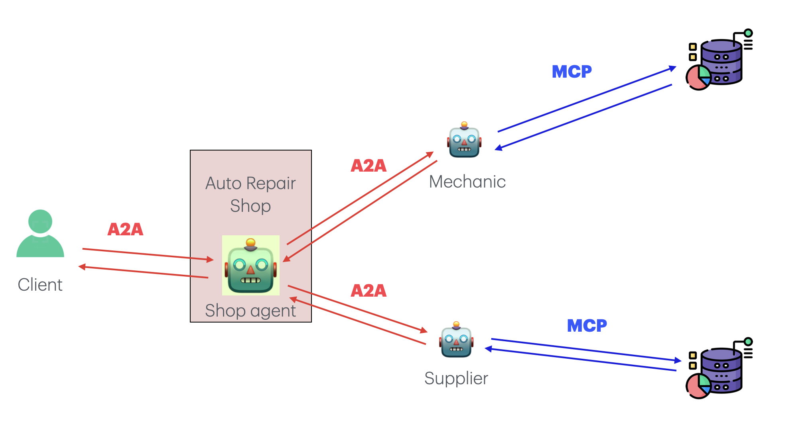

# Car Repair Shop Assistant: Agent2Agent and MCP Integration



## Introduction

In the fast-moving world of agentic AI, two open protocols quietly solve the headaches that used to keep multi-agent projects from ever leaving the lab.

A few months ago, Anthropic introduced [Model Context Protocol (MCP)](https://www.anthropic.com/news/model-context-protocol): A reliable access to the data and tools an agent needs once the conversation begins. Anthropic describes MCP as a USB-C port for language models—a single, well-defined connector that lets you plug the same model into GitHub, a Postgres database, or a custom knowledge base without rewriting the integration each time. By standardizing the way hosts, clients, and servers exchange "Tools," "resources," and "prompts," MCP turns context into something the model can count on rather than something developers keep stitching together ad hoc.

Agent2Agent (A2A), a new protocol by Google, tackles another obstacle: getting autonomous agents—often built on different frameworks and hosted in different places—to understand one another. Instead of brittle, one-off bridges, A2A gives every agent a tiny "agent card" that advertises its skills and an HTTP interface that lets other agents negotiate tasks, stream intermediate results, and hand over artifacts. Google started the project to give agents a common language regardless of vendor, and the open-source spec already shows how discovery, task life-cycle updates, and secure push notifications can work out of the box.

With A2A handling how agents talk to one another and MCP handling how they tap into the outside world, you end up with small, focused agents who can coordinate fluently and still see the bigger picture—an architecture that feels less like a collection of scripts and more like a cooperative workforce.

## Car Repair Shop Scenario

This project demonstrates a complete agentic pipeline for a car repair shop using Agent2Agent and MCP protocols. The system consists of specialized agents that work together to handle various aspects of the repair business:

**Shop Manager Agent**: The main coordinator that orchestrates all shop operations, manages customer interactions, and delegates tasks to specialized agents.

**Mechanic Agent**: Handles technical diagnostics, repair procedures, and maintenance tasks. Has access to repair manuals, diagnostic tools, and technical specifications.

**Supplier Agent**: Manages parts inventory, procurement, and supplier relationships. Can search for parts, check availability, and manage ordering processes.

The agents communicate through the A2A protocol and access external resources through MCP servers, creating a realistic simulation of how AI agents might coordinate in a real business environment.

## The Structure of this Tutorial

This tutorial will build a complete agentic pipeline using Agent2Agent and MCP. First, we will create and test a couple of simple MCP servers. Then, we will create a simple agent that uses MCP to get information. Finally, we will have a whole crew of agents that uses Agent2Agent to coordinate with each other while using MCP to get information.

For the sake of simplicity, we will use elementary agents that have access to single MCPs and MCPs that perform easy operations like fetching data from an API or searching the web.

We imagine we want to create a team of agents able to handle various car repair shop operations; in particular, we want to be able to handle scenarios such as "My car is making a strange noise when I brake" or "I need to order brake pads for a 2018 Honda Civic".

## Note on the Code

The code for this tutorial is available on [GitHub](https://github.com/Tsadoq/a2a-mcp-tutorial). You should clone the repository, run the code locally, play around with it, and even modify it. This tutorial has been created by starting from two sources:

- [Agent2Agent Tutorial](https://github.com/google/A2A)
- [MCP Tutorial](https://modelcontextprotocol.io/quickstart/server)

While the MCP documentation was terrific, the Google Agent2Agent repository had multiple issues and was not working as expected. As a consequence, I heavily modified the code provided.

### How to run it

[uv by Astral](https://docs.astral.sh/uv/) was used as a Python package and project manager. You can clone the repo, run `uv sync`, and then run whatever you need.


# MCP Servers

Given our car repair shop scenario, we first define specialized services:
- A search engine service for finding repair information, parts availability, and technical documentation
- Additional services for inventory management, diagnostic procedures, and supplier information

## The Search Engine Service

We define a search service using Serper APIs for web searching and page scraping. This service helps agents find repair procedures, troubleshooting guides, parts specifications, and other relevant information from across the web.

The search service provides two main capabilities:
1. **Web Search**: Search for repair information, part specifications, troubleshooting guides
2. **Page Scraping**: Extract detailed content from repair manuals, technical documentation, and parts catalogs

## The Web Search and Scraping Service

This service enables our agents to find and access repair information from across the web.

```python
    class SerperDevService:
    def __init__(self):
        self.__api_key__=os.getenv("SERPER_DEV_API_KEY")
        self.search_url = "https://google.serper.dev/search"
        self.scraper_url = "https://scrape.serper.dev"

    def search_google(
            self,
            query: str,
            n_results: int = 10,
            page: int = 1,
 ) -> List[Dict[str, Any]]:
        """
 Search Google using the Serper.dev API.
 :param query: the query to search on google
 :param n_results: number of results to return per page
 :param page: page number to return
 :return: a list of dictionaries containing the search results
 """
 payload = json.dumps(
 {
                "q": query,
                "num": n_results,
                "page": page
 },
 )
 headers = {
            'X-API-KEY': self.__api_key__,
            'Content-Type': 'application/json'
 }

 response = requests.request(
            method="POST",
            url=self.search_url,
            headers=headers,
            data=payload,
 )

        return response.json()['organic']


    def get_text_from_page(self, url_to_scrape: str) -> str:
        """
 Get text from a page using the Serper.dev API.
 :param url_to_scrape: the url of the page to scrape
 :return: the text content of the page
 """
 payload = json.dumps(
 {
                "url": url_to_scrape,
 }
 )
 headers = {
            'X-API-KEY': self.__api_key__,
            'Content-Type': 'application/json'
 }

 response = requests.request(
            method="POST",
            url=self.scraper_url,
            headers=headers,
            data=payload,
 )

        return response.text
```

## From Service to Server

It is now time to transform these services into MCP server(s). For our car repair shop, we create specialized MCP servers that provide different capabilities to our agents. This modular approach allows each agent to access only the tools they need for their specific role in the shop.

Within the Model Context Protocol, servers come in two flavors distinguished by their transport layer. An STDIO MCP server runs as a local subprocess and pipes JSON-RPC messages over its own stdin/stdout streams, giving minimal latency, full-duplex messaging, and zero network dependencies: it is ideal for command-line tools or same-machine integrations. A Server-Sent Events (SSE) MCP server instead exposes an HTTP endpoint: the client sends requests with lightweight POSTs while the server pushes results back on a single SSE stream, making it naturally web-friendly and accessible across networks or from a browser. In practice, stdio is the lean, no-frills option when everything lives on one host, whereas SSE trades a bit of HTTP overhead and one-way streaming semantics for firewall traversal, browser compatibility, and remote reach.

Given our use case, it seems natural to use the first solution (but we will discover it is not that simple).

```python
mcp = FastMCP("Search Engine Server")

search_service = SerperDevService()

@mcp.tool()
def search_google(
    query: str,
    n_results: int = 10,
    page: int = 1,
) -> list:
    """
 Search Google using the Serper.dev API.
 :param query: the query to search on google
 :param n_results: number of results to return per page
 :param page: page number to return
 :return: a list of dictionaries containing the search results
 """
    return search_service.search_google(query, n_results, page)

@mcp.tool()
def get_text_from_page(url_to_scrape: str) -> str:
    """
 Get text from a page using the Serper.dev API.
 :param url_to_scrape: the url of the page to scrape
 :return: the text content of the page
 """
    return search_service.get_text_from_page(url_to_scrape)

if __name__ == "__main__":
 mcp.run(transport='stdio')
```

The code is straightforward (and highly similar to FastAPI, not surprisingly, given that it is used to implement this MCP library).

We first initialise the MCP server with `mcp = FastMCP("<NAME_OF_SERVER>")`, then, we define the endpoint/tools using the decorator `@mcp.tool()`.

We define the Stocks scraper MCP server in the very same way.

## Let's use the MCP Server

So, at this point we have our working MCP server and we just need to use it. Given this tutorial is about A2A Framework as well, and A2A has been created by Google, we will use the new google ADK to create our agents. To start, we create a single, simple agent that use our MCP server to search for repair information and technical documentation.

We first create a function that spawns our MCP server and "transforms" it into a tool for our ADK agent.

```python
async def get_tools_async():
  """Gets tools from the Search MCP Server."""
  print("Attempting to connect to MCP Filesystem server...")
  tools, exit_stack = await MCPToolset.from_server(
      connection_params=StdioServerParameters(
          command="/opt/homebrew/bin/uv", # on macos you need to use this path
          args=[
              "--directory",
              "/root/path/to/mcp_server",
              "run",
              "search_server.py"
          ],
          env={
              "PYTHONPATH": <YOUR_PYTHONPATH_IF_NEEDED>
          },
      )
  )
  print("MCP Toolset created successfully.")
  return tools, exit_stack
```

This function will spawn our MCP server and return the tools and the exit stack.

Now, we can create our agent in a similar fashion.

```python
async def get_agent_async():
  """Creates an ADK Agent equipped with tools from the MCP Server."""
  tools, exit_stack = await get_tools_async()
  print(f"Fetched {len(tools)} tools from MCP server.")
  root_agent = LlmAgent(
      model='gemini-2.0-flash-lite',
      name='repair_assistant',
      description="Agent to assist with car repair queries using web search.",
      instruction="You are an expert car repair assistant. When someone asks about car problems or repairs, you search for accurate technical information online. You always stick to factual repair procedures and safety guidelines.",
      tools=tools, # 
  )
  return root_agent, exit_stack
```

This function will create an ADK agent equipped with the tools from the MCP server.

We can now put everything together and create our agent pipeline.

```python

async def async_main():
    session_service = InMemorySessionService()
    artifacts_service = InMemoryArtifactService()
    print("Creating session...")
    session = session_service.create_session(
        state={}, app_name='mcp_search_app', user_id='searcher_usr', session_id='searcher_session'
    )
    print(f"Session created with ID: {session.id}")

    query = "My 2018 Honda Civic is making a grinding noise when I brake. What could be the cause and how should I fix it?"
    print(f"User Query: '{query}'")
    content = types.Content(role='user', parts=[types.Part(text=query)])
    root_agent, exit_stack = await get_agent_async()

    runner = Runner(
        app_name='mcp_search_app',
        agent=root_agent,
        artifact_service=artifacts_service,
        session_service=session_service,
    )

    print("Running agent...")
    events_async = runner.run_async(
        session_id=session.id, user_id=session.user_id, new_message=content
    )

    async for event in events_async:
        if event.is_final_response():
            if event.content and event.content.parts:
                final_response_text = event.content.parts[0].text
            elif event.actions and event.actions.escalate:  # Handle potential errors/escalations
                final_response_text = f"Agent escalated: {event.error_message or 'No specific message.'}"
            print(f"############# Final Response #############\n\n{final_response_text}")
            break


    print("Closing MCP server connection...")
    await exit_stack.aclose()
    print("Cleanup complete.")
```

This function will create a session, run the agent, and print the final response to the car repair query.


## Multiple Local MCP Servers: where STDIO is not enough

Now, we have a single MCP server that can be used by our agent. However, especially if we plan to play with multiple agents, we want to have multiple MCP servers, each one with a specific purpose. For example, we want one MCP server to search for repair information, another to manage inventory and parts, and so on.

If you try to spawn multiple STDIO-based MCP servers, you will notice that they will not work at the same time. To solve this problem, we can use an SSE-based MCP server with some tricks.

It is quite simple: we declare the "endpoints" as before, 

```python
@mcp.tool()
def search_google(
    query: str,
    n_results: int = 10,
    page: int = 1,
) -> list:
    """
    Search Google using the Serper.dev API.
    :param query: the query to search on google
    :param n_results: number of results to return per page
    :param page: page number to return
    :return: a list of dictionaries containing the search results
    """
    return search_service.search_google(query, n_results, page)

@mcp.tool()
def get_text_from_page(url_to_scrape: str) -> str:
    """
    Get text from a page using the Serper.dev API.
    :param url_to_scrape: the url of the page to scrape
    :return: the text content of the page
    """
    return search_service.get_text_from_page(url_to_scrape)
```

Then, we wrap the server in a Startlette app:

```python
def create_starlette_app(
        mcp_server: Server,
        *,
        debug: bool = False,
) -> Starlette:
    """
    Create a Starlette application that can server the provied mcp server with SSE.
    :param mcp_server: the mcp server to serve
    :param debug: whether to enable debug mode
    :return: a Starlette application
    """

    sse = SseServerTransport("/messages/")

    async def handle_sse(request: Request) -> None:
        async with sse.connect_sse(
                request.scope,
                request.receive,
                request._send,
        ) as (read_stream, write_stream):
            await mcp_server.run(
                read_stream,
                write_stream,
                mcp_server.create_initialization_options(),
            )

    return Starlette(
        debug=debug,
        routes=[
            Route("/sse", endpoint=handle_sse),
            Mount("/messages/", app=sse.handle_post_message),
        ],
    )
```

We can then run each server with a different port as follows:

```python
mcp_server = mcp._mcp_server  # noqa: WPS437
parser = argparse.ArgumentParser(description='Run MCP SSE-based server')
parser.add_argument('--host', default='0.0.0.0', help='Host to bind to')
parser.add_argument('--port', type=int, default=8080, help='Port to listen on')
args = parser.parse_args()
starlette_app = create_starlette_app(mcp_server, debug=True)
uvicorn.run(starlette_app, host=args.host, port=args.port)
```

To pass such a server to an ADK agent, as a tool we'll need something like:

```python
async def return_sse_mcp_tools_search():
    print("Attempting to connect to MCP server for search and page read...")
    server_params = SseServerParams(
        url="http://localhost:<CHOSEN_PORT>/sse",
    )
    tools, exit_stack = await MCPToolset.from_server(connection_params=server_params)
    print("MCP Toolset created successfully.")
    return tools, exit_stack
```


# Multiple Agents

It is now time to create a more complex pipeline with multiple agents. At first, we will create a hierarchical crew of agents using the ADK library by Google, then, after seeing that our solution works, we will use Agent2Agent framework to create peer-to-peer agents able to coordinate with each other.

## Hierarchical Crew

Now that we have our MCP servers set up, we can create a hierarchical crew of agents using the ADK library. In this example, we'll create a team of agents that can handle car repair shop operations, with a main shop manager agent delegating tasks to specialized sub-agents.

### Setting Up the Crew

First, we define some constants for our application:

```python
MODEL = 'gemini-2.0-flash-lite'
APP_NAME = 'car_repair_shop_app'
USER_ID = 'shop_customer'
SESSION_ID = 'repair_session'
```

These constants define the model we'll use (Gemini 2.5 Pro), the application name, and session identifiers.

### Creating Specialized Agents

We create two specialized agents, each with their own set of tools:

1. **Mechanic Agent**: This agent is responsible for technical diagnostics, repair procedures, and troubleshooting car problems.

```python
mechanic_agent = Agent(
    model=MODEL,
    name="mechanic_agent",
    instruction="Expert mechanic specializing in car diagnostics and repair procedures.",
    description="Handles technical diagnostics, repair procedures, and provides expert automotive advice.",
    tools=search_tools,
)
```

2. **Supplier Agent**: This agent specializes in parts management, inventory, and supplier relations.

```python
supplier_agent = Agent(
    model=MODEL,
    name="supplier_agent",
    instruction="Expert in automotive parts, inventory management, and supplier relations.",
    description="Handles parts searches, availability checks, and supplier management.",
    tools=search_tools,
)
```

### The Root Agent

The root agent acts as the coordinator, delegating tasks to the specialized agents based on the user's query:

```python
root_agent = Agent(
    name="shop_manager",
    model=MODEL,
    description="Main shop manager: Handles customer requests and coordinates repair shop operations.",
    instruction=(
        "You are the main Shop Manager coordinating a car repair team. Your primary responsibilities are managing customer requests and delegating repair tasks.\n"
        "1. If the customer asks about car problems or repairs, delegate to the mechanic_agent for technical diagnosis.\n"
        "2. If you need information about parts, availability, or ordering, delegate to the supplier_agent.\n"
        "3. Provide clear coordination between technical diagnosis and parts management.\n"
        "Analyze the customer's request and delegate appropriately. If unsure, ask for clarification. Always prioritize customer safety and proper repair procedures."
    ),
    sub_agents=[mechanic_agent, supplier_agent],
    output_key="last_assistant_response",
)
```

The root agent's instruction clearly defines its role and how it should delegate tasks to its sub-agents. It's designed to:
- Manage customer interactions and repair requests
- Delegate technical problems to the mechanic agent
- Delegate parts-related queries to the supplier agent
- Coordinate between diagnosis and parts management
- Prioritize safety and proper procedures

### Running the Crew

The main function sets up the session and runs the agent pipeline:

```python
async def async_main():
    # Initialize services
    session_service = InMemorySessionService()
    artifacts_service = InMemoryArtifactService()
    
    # Create session
    session = session_service.create_session(
        state={},
        app_name=APP_NAME,
        user_id=USER_ID,
        session_id=SESSION_ID,
    )

    # Get user query
    query = input("Enter your query:\n")
    content = types.Content(role='user', parts=[types.Part(text=query)])
    
    # Initialize tools from MCP servers
    search_tools, search_exit_stack = await return_sse_mcp_tools_search()

    # Create and run the agent pipeline
    runner = Runner(
        app_name=APP_NAME,
        agent=root_agent,
        artifact_service=artifacts_service,
        session_service=session_service,
    )

    # Process events and get final response
    events_async = runner.run_async(
        session_id=session.id, 
        user_id=session.user_id, 
        new_message=content
    )

    async for event in events_async:
        if event.is_final_response():
            if event.content and event.content.parts:
                final_response_text = event.content.parts[0].text
            elif event.actions and event.actions.escalate:
                final_response_text = f"Agent escalated: {event.error_message or 'No specific message.'}"
            print(colored(text=f"############# Final Response #############\n\n{final_response_text}", color='green'))
            break
        else:
            print(event)

    # Cleanup
    await search_exit_stack.aclose()
```

This implementation creates a hierarchical crew where:
1. The shop manager receives the customer's query
2. It analyzes the query and decides whether to:
   - Handle it directly
   - Delegate to the mechanic agent for technical issues
   - Delegate to the supplier agent for parts-related queries
3. The specialized agents use their respective MCP tools to gather information
4. The shop manager coordinates the responses and provides a final answer to the customer

The crew will automatically delegate tasks to the appropriate agents and provide comprehensive responses combining technical diagnosis with parts management information.

## Agent2Agent Crew

Now, it's time to finally play with the Agent2Agent framework. As we previously said, A2A is a framework that allows agents to coordinate with each other in a peer-to-peer manner by using a standardised interface.

The said agents can be implemented in any language or framework that supports the A2A interface. In this example, we will use the ADK library by Google to create the agents for simplicity.

A further disclaimer: at the time of writing, the A2A implementations i've found online, comprised the one from google, are quite raw, for this example I have __heavily__ takend and modified the code from the [A2A tutorial](https://github.com/google/agent2agent/blob/main/python/agent2agent/examples/adk/adk_tutorial.ipynb) from the official repository.

### The Main Conceptual Components

The Agent2Agent (A2A) protocol enables seamless interaction between autonomous AI agents. Here are its fundamental building blocks:

**Agent Card**: A standardized metadata document (typically located at `/.well-known/agent.json`) that serves as an agent's digital identity card. It details the agent's capabilities, available skills, service endpoint, and security requirements, enabling other agents to discover and understand how to interact with it.

**A2A Server**: An agent that implements the A2A protocol by exposing an HTTP endpoint. It handles incoming requests, manages task execution, and maintains communication with clients according to the protocol specifications.

**A2A Client**: Any application or agent that consumes A2A services. It initiates interactions by sending requests (such as `tasks/send` or `tasks/sendSubscribe`) to an A2A Server's endpoint.

**Task**: The primary unit of work in A2A. When a client initiates a task, it creates a unique conversation thread that can progress through various states: submitted, working, input-required, completed, failed, or canceled. Each task maintains its own context and history.

**Message**: The basic unit of communication between clients and agents. Messages contain a role (either "user" or "agent") and are composed of one or more Parts, forming the conversation thread.

**Part**: The atomic content unit within Messages or Artifacts. Parts can be of different types:
- TextPart: For plain text content
- FilePart: For file data (either inline or referenced via URI)
- DataPart: For structured JSON data (commonly used for forms or structured responses)

**Artifact**: Represents any output generated by an agent during task execution. This could include generated files, structured data, or other resources. Like Messages, Artifacts are composed of Parts.

**Streaming**: For tasks that require extended processing time, servers can implement streaming capabilities through `tasks/sendSubscribe`. This allows clients to receive real-time updates via Server-Sent Events (SSE), including task status changes and new artifacts.

**Push Notifications**: Servers supporting this feature can proactively notify clients about task updates through a webhook URL. Clients configure their notification endpoint using `tasks/pushNotification/set`.

#### Typical Interaction Flow

1. **Discovery**: The client retrieves the Agent Card from the server's well-known URL to understand the agent's capabilities and requirements.

2. **Initiation**: The client starts a new task by sending a `tasks/send` or `tasks/sendSubscribe` request, including the initial message and a unique Task ID.

3. **Processing**:
   - In streaming mode: The server sends real-time updates via SSE, including status changes and new artifacts
   - In non-streaming mode: The server processes the task synchronously and returns the final result

4. **Interaction**: If the task requires additional input, the client can send follow-up messages using the same Task ID.

5. **Completion**: The task eventually reaches a final state (completed, failed, or canceled), concluding the interaction.

### The ADKAgent Class

Now that we understand the conceptual components of A2A, let's look at how we can implement it using the ADK library. The following code shows how to create an agent that can both act as a standalone agent and coordinate with other agents in the network.

The `ADKAgent` class serves as the foundation for our A2A implementation. It bridges the Google ADK framework with the A2A protocol, allowing agents to communicate and coordinate tasks. Here's a breakdown of its key components:

```python
class ADKAgent:
    """An agent that handles stock report requests."""

    SUPPORTED_CONTENT_TYPES = ["text", "text/plain"]

    def __init__(
            self,
            model: str,
            name: str,
            description: str,
            instructions: str,
            tools: List[Any],
            is_host_agent: bool = False,
            remote_agent_addresses: List[str] = None,
            task_callback: TaskUpdateCallback | None = None
    ):
        # ... initialization code ...
```

The class can be configured in two modes:
1. **Standalone Agent**: When `is_host_agent=False`, it acts as a regular ADK agent with its own tools and capabilities
2. **Host Agent**: When `is_host_agent=True`, it becomes a coordinator that can delegate tasks to other agents

#### Key Features

1. **Remote Agent Management**:
```python
def register_agent_card(self, card: AgentCard):
    remote_connection = RemoteAgentConnections(card)
    self.remote_agent_connections[card.name] = remote_connection
    self.cards[card.name] = card
```
This method allows the agent to discover and connect to other agents in the network. Each agent's capabilities are described in its `AgentCard`, which is stored in the `.well-known/agent.json` file.

2. **Task Delegation**:
```python
async def send_task(
    self,
    agent_name: str,
    message: str,
    tool_context: ToolContext
):
    # ... task delegation code ...
```
The `send_task` method handles the core A2A protocol interaction. It:
- Creates a new task with a unique ID
- Sends the task to the specified remote agent
- Manages the task lifecycle (submitted, working, completed, etc.)
- Handles responses and artifacts from the remote agent

3. **State Management**:
```python
def check_state(self, context: ReadonlyContext):
    state = context.state
    if ('session_id' in state and
            'session_active' in state and
            state['session_active'] and
            'agent' in state):
        return {"active_agent": f'{state["agent"]}'}
    return {"active_agent": "None"}
```
The agent maintains state information about:
- Active sessions
- Current tasks
- Connected agents
- Conversation context

4. **Response Processing**:
```python
def convert_parts(parts: list[Part], tool_context: ToolContext)
def convert_part(part: Part, tool_context: ToolContext)
```
These methods handle the conversion between different response formats, supporting:
- Text responses
- Structured data
- File attachments
- Artifacts

#### Usage Example

Here's how you can use the `ADKAgent` to create a shop manager agent that delegates tasks to specialized repair agents:

```python
# Create a shop manager host agent
shop_manager = ADKAgent(
    model="gemini-2.0-flash-lite",
    name="shop_manager",
    description="Car repair shop manager agent",
    instructions="Coordinate repair tasks between mechanic and supplier agents",
    tools=[],
    is_host_agent=True,
    remote_agent_addresses=["http://mechanic:8080", "http://supplier:8080"]
)
```

### The Agent Card Class
In the previous piece of code, we have seen a `AgentCard` object being used in many places.


The `AgentCard` class is a crucial component of the Agent2Agent (A2A) protocol, serving as a standardized way to describe an agent's capabilities and requirements. It's essentially an agent's digital identity card that other agents can use to discover and understand how to interact with it.

Let's break down the key components of the `generate_agent_card` function:

1. **Basic Agent Information**:
   - `agent_name`: A unique identifier for the agent
   - `agent_description`: A human-readable description of what the agent does
   - `agent_url`: The endpoint where the agent can be reached
   - `agent_version`: The version of the agent implementation

2. **Capabilities**:
   - `can_stream`: Indicates if the agent supports streaming responses via Server-Sent Events (SSE)
   - `can_push_notifications`: Specifies if the agent can send push notifications
   - `can_state_transition_history`: Determines if the agent maintains a history of state transitions

3. **Communication Settings**:
   - `authentication`: Defines the authentication method required to interact with the agent
   - `default_input_modes`: Lists the supported input formats (e.g., "text", "json")
   - `default_output_modes`: Lists the supported output formats

4. **Skills**:
   - `skills`: A list of `AgentSkill` objects that describe the specific capabilities of the agent

Here's an example of how to use the `generate_agent_card` function to create a card for a mechanic agent:

```python
mechanic_agent_card = generate_agent_card(
    agent_name="mechanic_agent",
    agent_description="Expert mechanic for car diagnostics and repair procedures",
    agent_url="http://localhost:8080",
    agent_version="1.0.0",
    can_stream=True,
    can_push_notifications=True,
    skills=[
        AgentSkill(
            name="car_diagnostics",
            description="Diagnoses car problems and provides repair recommendations",
            input_schema={
                "type": "object",
                "properties": {
                    "symptoms": {"type": "string"},
                    "vehicle_info": {"type": "string"}
                }
            },
            output_schema={
                "type": "object",
                "properties": {
                    "diagnosis": {"type": "string"},
                    "repair_steps": {"type": "array"}
                }
            }
        )
    ]
)
```

The generated agent card is typically served at the `/.well-known/agent.json` endpoint of the agent's URL. This standardized location allows other agents to discover and understand how to interact with the agent without prior knowledge of its implementation details.

When another agent wants to interact with this agent, it can:
1. Fetch the agent card from `/.well-known/agent.json`
2. Verify that the agent supports the required capabilities
3. Check if the agent has the necessary skills
4. Use the provided URL and authentication method to establish communication

### The A2A Server

To make the agent "contactable", we need to implement the A2A server. The server is responsible for handling incoming requests from other agents and managing the communication protocol. Here's a breakdown of the key components:

1. **Server Initialization**:
```python
class A2AServer:
    def __init__(
        self,
        host="0.0.0.0",
        port=5000,
        endpoint="/",
        agent_card: AgentCard = None,
        task_manager: TaskManager = None,
    ):
        self.host = host
        self.port = port
        self.endpoint = endpoint
        self.task_manager = task_manager
        self.agent_card = agent_card
        self.app = Starlette()
        self.app.add_route(self.endpoint, self._process_request, methods=["POST"])
        self.app.add_route(
            "/.well-known/agent.json", self._get_agent_card, methods=["GET"]
        )
```
The server is initialized with:
- Host and port configuration
- An endpoint for handling requests
- An agent card describing the agent's capabilities
- A task manager for handling task execution

2. **Request Processing**:
```python
async def _process_request(self, request: Request):
    try:
        body = await request.json()
        json_rpc_request = A2ARequest.validate_python(body)
        if isinstance(json_rpc_request, GetTaskRequest):
            result = await self.task_manager.on_get_task(json_rpc_request)
        elif isinstance(json_rpc_request, SendTaskRequest):
            result = await self.task_manager.on_send_task(json_rpc_request)
        # ... handle other request types ...
```
The server processes different types of requests:
- Task creation and management
- Streaming task updates
- Push notifications
- Task cancellation

3. **Asynchronous Server Startup**:
```python
async def astart(self):
    if self.agent_card is None:
        raise ValueError("agent_card is not defined")

    if self.task_manager is None:
        raise ValueError("request_handler is not defined")

    config = uvicorn.Config(self.app, host=self.host, port=self.port, loop="asyncio")
    server = uvicorn.Server(config)

    # start in the background
    server_task = asyncio.create_task(server.serve())

    # wait for startup
    while not server.started:
        await asyncio.sleep(0.1)
    print("Server is up – press Ctrl+C to shut it down manually")

    try:
        await server_task
    except KeyboardInterrupt:
        server.should_exit = True
        await server_task
```

The `astart` method is a crucial modification from the original Google implementation. Here's why:

1. **Original Implementation**:
```python
def start(self):
    if self.agent_card is None:
        raise ValueError("agent_card is not defined")
    if self.task_manager is None:
        raise ValueError("request_handler is not defined")
    uvicorn.run(self.app, host=self.host, port=self.port)
```
The original implementation used a synchronous `start` method that blocked the main thread. This was problematic because:
- It couldn't be integrated into an existing async event loop
- It made it difficult to coordinate with other async components (like MCP tools)

2. **New Implementation**:
The new `astart` method:
- Creates a Uvicorn server with an async event loop
- Starts the server in the background using `asyncio.create_task`
- Waits for the server to be fully started
- Handles graceful shutdown on keyboard interrupt
- Can be integrated into an existing async application

This change was necessary because:
- MCP tools are inherently asynchronous
- The server needs to be able to run alongside other async components
- We need proper control over the server lifecycle

4. **Response Handling**:
```python
def _create_response(self, result: Any) -> JSONResponse | EventSourceResponse:
    if isinstance(result, AsyncIterable):
        async def event_generator(result) -> AsyncIterable[dict[str, str]]:
            async for item in result:
                yield {"data": item.model_dump_json(exclude_none=True)}
        return EventSourceResponse(event_generator(result))
    elif isinstance(result, JSONRPCResponse):
        return JSONResponse(result.model_dump(exclude_none=True))
```
The server supports two types of responses:
- Regular JSON responses for immediate results
- Server-Sent Events (SSE) for streaming updates

This implementation allows the A2A server to:
- Handle multiple concurrent requests
- Support streaming responses
- Integrate with async components
- Provide proper error handling
- Support graceful shutdown

The server can now be used in an async context like this:
```python
async def main():
    server = A2AServer(
        host="0.0.0.0",
        port=5000,
        agent_card=my_agent_card,
        task_manager=my_task_manager
    )
    await server.astart()
```

This makes it possible to integrate the A2A server with other async components, such as MCP tools or other agents, while maintaining proper control over the server lifecycle.

### The A2A Card Resolver

The A2A Card Resolver is a class that is used to resolve the agent card of an agent. It is used to find the agent card of an agent when it is not known. The code is quite simple:

```python
class A2ACardResolver:
    def __init__(self, base_url, agent_card_path="/.well-known/agent.json"):
        self.base_url = base_url
        self.agent_card_path = agent_card_path.lstrip("/")

    def get_agent_card(self) -> AgentCard:
        with httpx.Client() as client:
            url = re.match(r'(https?://[^/]+)', self.base_url).group(1).rstrip("/")
            response = client.get(url + "/" + self.agent_card_path)
            response.raise_for_status()
            try:
                resp_dict = response.json()
                resp_dict['url'] = self.base_url
                return AgentCard(**resp_dict)
            except json.JSONDecodeError as e:
                raise A2AClientJSONError(str(e)) from e
```

For some reason, the original example from Google was not working. since it "destroyed" the url while attaching the card path.

### Common Resources, utils and the rest

On top of those main components, in this tutorial we have used a list of other resources, many of them unchanged from the original tutorial: the vast majority can be found [here](https://github.com/Tsadoq/a2a-mcp-tutorial/blob/dd94b826801258c17a541fc900bd792c4e4d3686/a2a_servers/common).


### Putting everything together

So, now we have all the components we need to put everything together.

We create the Host Agent:

```python
async def run_agent():
    AGENT_NAME = "shop_manager_agent"
    AGENT_DESCRIPTION = "A car repair shop manager that coordinates repair tasks between mechanic and supplier agents."
    PORT = 12000
    HOST = "0.0.0.0"
    AGENT_URL = f"http://{HOST}:{PORT}"
    AGENT_VERSION = "1.0.0"
    MODEL = 'gemini-2.0-flash-lite'
    AGENT_SKILLS = [
        AgentSkill(
            id="COORDINATE_REPAIR_TASKS",
            name="coordinate_repair_tasks",
            description="coordinate repair tasks between mechanic and supplier agents.",
        ),
    ]

    list_urls = [
        "http://localhost:11000/mechanic_agent",
        "http://localhost:10000/supplier_agent",
    ]

    AGENT_CARD = generate_agent_card(
        agent_name=AGENT_NAME,
        agent_description=AGENT_DESCRIPTION,
        agent_url=AGENT_URL,
        agent_version=AGENT_VERSION,
        can_stream=False,
        can_push_notifications=False,
        can_state_transition_history=True,
        default_input_modes=["text"],
        default_output_modes=["text"],
        skills=AGENT_SKILLS,
    )

    shop_manager_agent = ADKAgent(
        model=MODEL,
        name="shop_manager_agent",
        description="Car repair shop manager",
        tools=[],
        instructions="You are a car repair shop manager. Coordinate repair tasks between mechanic and supplier agents to provide excellent customer service.",
        is_host_agent=True,
        remote_agent_addresses=list_urls,
    )

    task_manager = generate_agent_task_manager(
        agent=shop_manager_agent,
    )
    server = A2AServer(
        host=HOST,
        port=PORT,
        endpoint="/shop_manager_agent",
        agent_card=AGENT_CARD,
        task_manager=task_manager
    )
    print(f"Starting {AGENT_NAME} A2A Server on {AGENT_URL}")
    await server.astart()
```

The Mechanic Agent:

```python
async def run_agent():
    AGENT_NAME = "mechanic_agent"
    AGENT_DESCRIPTION = "An expert mechanic agent that handles car diagnostics and repair procedures."
    HOST = "0.0.0.0"
    PORT = 11000
    AGENT_URL = f"http://{HOST}:{PORT}"
    AGENT_VERSION = "1.0.0"
    MODEL = 'gemini-2.0-flash-lite'
    AGENT_SKILLS = [
        AgentSkill(
            id="CAR_DIAGNOSTICS",
            name="car_diagnostics",
            description="Handles car diagnostics, troubleshooting, and repair procedures.",
        ),
    ]

    AGENT_CARD = generate_agent_card(
        agent_name=AGENT_NAME,
        agent_description=AGENT_DESCRIPTION,
        agent_url=AGENT_URL,
        agent_version=AGENT_VERSION,
        can_stream=False,
        can_push_notifications=False,
        can_state_transition_history=True,
        default_input_modes=["text"],
        default_output_modes=["text"],
        skills=AGENT_SKILLS,
    )

    mechanic_tools, mechanic_exit_stack = await return_sse_mcp_tools_mechanic()

    mechanic_agent = ADKAgent(
        model=MODEL,
        name="mechanic_agent",
        description="Expert mechanic for car diagnostics and repair procedures.",
        tools=mechanic_tools,
        instructions=(
            "You are an expert car mechanic. You specialize in diagnosing car problems, "
            "providing repair procedures, and ensuring vehicle safety. Always prioritize "
            "safety and provide step-by-step repair instructions."
        ),
    )

    task_manager = generate_agent_task_manager(
        agent=mechanic_agent,
    )
    server = A2AServer(
        host=HOST,
        port=PORT,
        endpoint="/mechanic_agent",
        agent_card=AGENT_CARD,
        task_manager=task_manager
    )
    print(f"Starting {AGENT_NAME} A2A Server on {AGENT_URL}")
    await server.astart()
```

And the Supplier Agent:

```python
async def run_agent():
    AGENT_NAME = "supplier_agent"
    AGENT_DESCRIPTION = "An expert supplier agent that handles automotive parts sourcing and inventory management."
    PORT = 10000
    HOST = "0.0.0.0"
    AGENT_URL = f"http://{HOST}:{PORT}"
    AGENT_VERSION = "1.0.0"
    MODEL = 'gemini-2.0-flash-lite'
    AGENT_SKILLS = [
        AgentSkill(
            id="PARTS_MANAGEMENT",
            name="parts_management",
            description="Handles automotive parts sourcing, availability checking, and supplier management.",
        ),
    ]

    AGENT_CARD = generate_agent_card(
        agent_name=AGENT_NAME,
        agent_description=AGENT_DESCRIPTION,
        agent_url=AGENT_URL,
        agent_version=AGENT_VERSION,
        can_stream=False,
        can_push_notifications=False,
        can_state_transition_history=True,
        default_input_modes=["text"],
        default_output_modes=["text"],
        skills=AGENT_SKILLS,
    )

    supplier_tools, supplier_exit_stack = await return_sse_mcp_tools_supplier()

    supplier_agent = ADKAgent(
        model=MODEL,
        name="supplier_agent",
        description="Expert in automotive parts sourcing and inventory management.",
        tools=supplier_tools,
        instructions=(
            "You are an expert automotive parts supplier. You specialize in finding parts, "
            "checking availability, managing inventory, and coordinating with suppliers. "
            "Always provide accurate part numbers, pricing information, and delivery timelines."
        ),
    )

    task_manager = generate_agent_task_manager(
        agent=supplier_agent,
    )
    server = A2AServer(
        host=HOST,
        port=PORT,
        endpoint="/supplier_agent",
        agent_card=AGENT_CARD,
        task_manager=task_manager
    )
    print(f"Starting {AGENT_NAME} A2A Server on {AGENT_URL}")
    await server.astart()
```

Then, run everything.

First the MCP Servers:

```bash
export PYTHONPATH="${PYTHONPATH}:$(pwd)"
uv run mcp_server/sse/mechanic_server.py
```

```bash
export PYTHONPATH="${PYTHONPATH}:$(pwd)"
uv run mcp_server/sse/supplier_server.py
```

And then the A2A Servers:

```bash
export PYTHONPATH="${PYTHONPATH}:$(pwd)"
uv run a2a_servers/agent_servers/mechanic_agent_server.py
```

```bash
export PYTHONPATH="${PYTHONPATH}:$(pwd)"
uv run a2a_servers/agent_servers/supplier_agent_server.py
```

And finally, the Host Agent:

```bash
export PYTHONPATH="${PYTHONPATH}:$(pwd)"
uv run a2a_servers/agent_servers/shop_manager_agent_server.py
```

We can then contact the host agent (e.g, using the script at `a2a_servers/run_from_local_client.py`).
```bash
export PYTHONPATH="${PYTHONPATH}:$(pwd)"
uv run a2a_servers/run_from_local_shop_client.py
```
